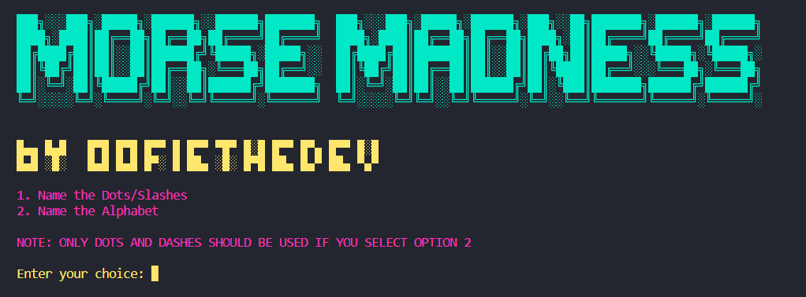

# Morse Madness

## :question: What is this?
This is a simple game I created in under an hour to test myself on Morse Code. Thought I would share it.

## :computer: Why I Made This
I had to learn Morse Code recently for reasons I shall not specify. So, I thought I would code a simple game to help me in memorising all the various meanings. Then I decided that I might as well publish it on GitHub.

## :keyboard: Fin
Enjoy!